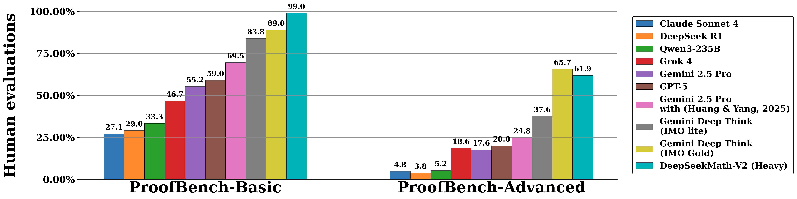
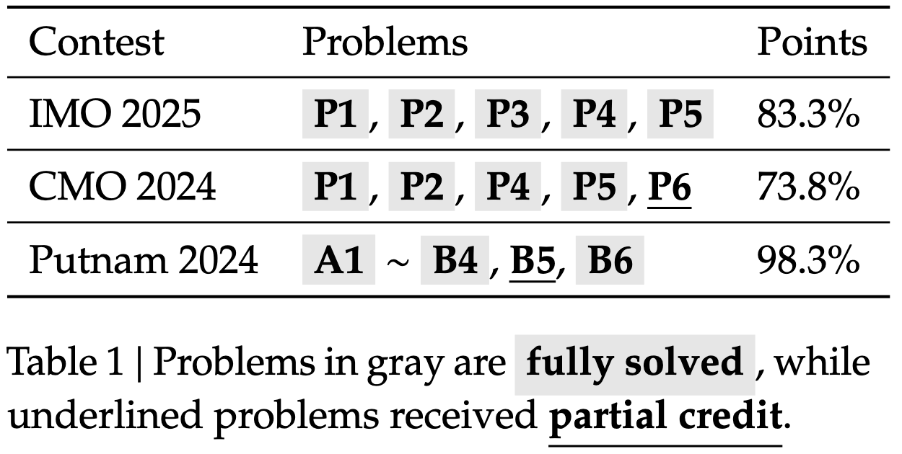

<!-- markdownlint-disable first-line-h1 -->
<!-- markdownlint-disable html -->
<!-- markdownlint-disable no-duplicate-header -->

<div align="center">
  
</div>
<hr>
<div align="center" style="line-height: 1;">
  <a href="https://www.deepseek.com/"></a>
  <a href="https://chat.deepseek.com/"></a>
  <a href="https://huggingface.co/deepseek-ai"></a>
  <br>
  <a href="https://discord.gg/Tc7c45Zzu5"></a>
  <a href="https://github.com/deepseek-ai/DeepSeek-V2/blob/main/figures/qr.jpeg?raw=true"></a>
  <a href="https://twitter.com/deepseek_ai"></a>
  <br>
  <a href="LICENSE" style="margin: 2px;">
    
  </a>
  <br>
</div>

# DeepSeekMath-V2: Towards Self-Verifiable Mathematical Reasoning

## 1. Introduction

Large language models have made significant progress in mathematical reasoning, which serves as an important testbed for AI and could impact scientific research if further advanced.
By scaling reasoning with reinforcement learning that rewards correct final answers, LLMs have improved from poor performance to saturating quantitative reasoning competitions like AIME and HMMT in one year.
However, this approach faces fundamental limitations.
Pursuing higher final answer accuracy doesn't address a key issue: correct answers don't guarantee correct reasoning.
Moreover, many mathematical tasks like theorem proving require rigorous step-by-step derivation rather than numerical answers, making final answer rewards inapplicable.
To push the limits of deep reasoning, we believe it is necessary to verify the comprehensiveness and rigor of mathematical reasoning.
Self-verification is particularly important for scaling test-time compute, especially for open problems without known solutions.
Towards self-verifiable mathematical reasoning, we investigate how to train an accurate and faithful LLM-based verifier for theorem proving.
We then train a proof generator using the verifier as the reward model, and incentivize the generator to identify and resolve as many issues as possible in their own proofs before finalizing them.
To maintain the generation-verification gap as the generator becomes stronger, we propose to scale verification compute to automatically label new hard-to-verify proofs, creating training data to further improve the verifier.
Our resulting model, DeepSeekMath-V2, demonstrates strong theorem-proving capabilities, achieving gold-level scores on IMO 2025 and CMO 2024 and a near-perfect 118/120 on Putnam 2024 with scaled test-time compute.
While much work remains, these results suggest that self-verifiable mathematical reasoning is a feasible research direction that may help develop more capable mathematical AI systems.

## 2. Evaluation Results

Below are evaluation results on [IMO-ProofBench](https://github.com/google-deepmind/superhuman/tree/main/imobench) (developed by the DeepMind team behind DeepThink IMO-Gold) and recent mathematics competitions including IMO 2025, CMO 2024, and Putnam 2024.
Model predictions are available in the `outputs` folder.

**IMO-ProofBench**

<p align="center">
  
</p>


---

**Mathematics Competitions**

<p align="center">
  
</p>

## 4. Download & Quick Start

DeepSeekMath-V2 is built on top of DeepSeek-V3.2-Exp-Base, which can be downloaded from [🤗 HuggingFace](https://huggingface.co/deepseek-ai/DeepSeek-Math-V2).
For inference support, please refer to [the DeepSeek-V3.2-Exp github repository](https://github.com/deepseek-ai/DeepSeek-V3.2-Exp).

## 6. License
The use of DeepSeekMath-V2 models is subject to [the Model License](LICENSE).

## 7. Citation

```
@misc{deepseek-math-v2,
  author = {Zhihong Shao, Yuxiang Luo, Chengda Lu, Z.Z. Ren, Jiewen Hu, Tian Ye, Zhibin Gou, Shirong Ma, Xiaokang Zhang},
  title = {DeepSeekMath-V2: Towards Self-Verifiable Mathematical Reasoning},
  year = {2025},
}
```

## 8. Contact

If you have any questions, please raise an issue or contact us at [service@deepseek.com](mailto:service@deepseek.com).
